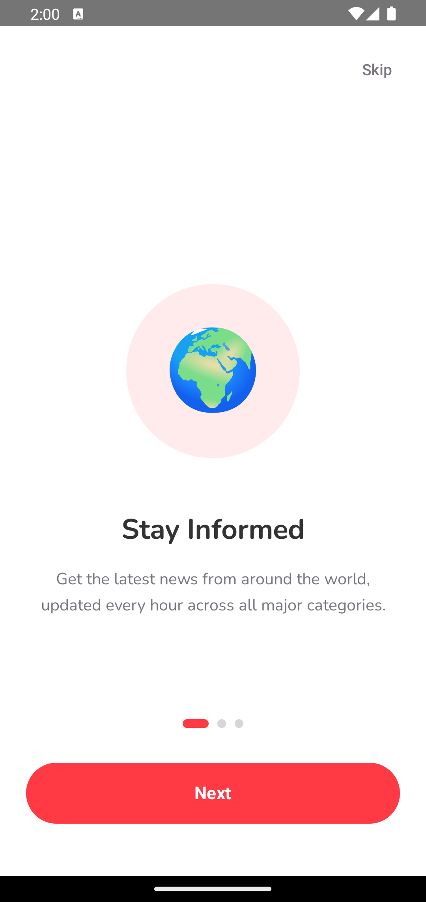
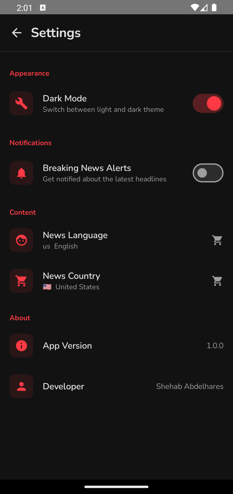
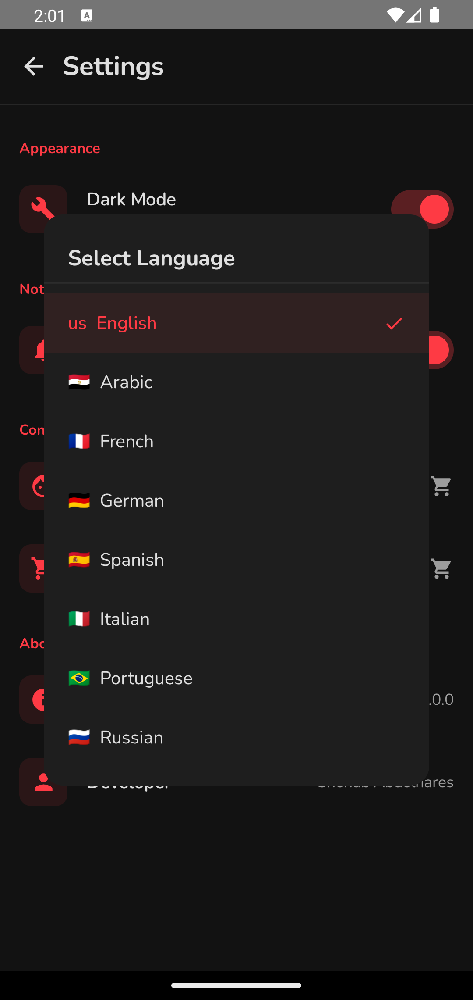

# 📰 Nexa

A production-grade Android **news** application built with **Clean Architecture**, **Jetpack Compose**, and modern Android development best practices.

---

## 📱 Screenshots

<p align="center"> 
  
  
  
  
  
  
</p>

---

## ✨ Features

- 🏠 **Home screen** — Top headlines horizontal scroll + 5 category tabs with vertical article list
- 🔍 **Search** — Real-time search with 500ms debounce + filter bottom sheet (sort by Recommended, Latest, Most Viewed)
- 📄 **Article detail** — Full article view with image, content, publisher info, and browser deep link
- ❤️ **Favorites** — Save articles with swipe-to-delete and persistent local storage
- 🌙 **Dark mode** — Full dark/light theme support controlled from settings
- 🔔 **Notifications** — Background news refresh every 15 minutes using WorkManager with push notifications
- 📡 **Offline caching** — Articles load from Room cache instantly even without internet
- 🌍 **Language selection** — 10 languages supported, passed to API calls
- 🗺️ **Country selection** — 15 countries supported for localized headlines
- ↕️ **Pull to refresh** — Refresh headlines and category articles with pull gesture
- 📤 **Article sharing** — Share any article title and URL via any installed app
- ♾️ **Pagination** — Infinite scroll with Paging 3, loads 20 articles per page
- 💀 **Shimmer loading** — Animated skeleton placeholders while content loads
- 🎬 **Animations** — Screen transitions, animated category chips, article fade-in effects
- 📶 **No internet banner** — Animated banner appears automatically when connection is lost
- 🎯 **Onboarding** — 3-page onboarding shown only on first launch, skippable
- ⚙️ **Settings** — Dark mode, notifications, language, country, app version
- 🔥 **Firebase Crashlytics** — Automatic crash reporting + non-fatal error logging

---

## 🏗️ Architecture

The project strictly follows **Clean Architecture** with 3 independent layers. Dependencies only point inward — Presentation knows about Domain, Data knows about Domain, but Domain knows nothing about either.

```
app/
│
├── data/
│   ├── remote/
│   │   ├── api/          # Retrofit API service — 5 GET endpoints
│   │   └── dto/          # JSON response models with @SerializedName
│   ├── local/
│   │   ├── dao/          # Room DAOs — headlines, categories, favorites
│   │   ├── entity/       # Room entities — 3 tables
│   │   └── database/     # AppDatabase — version 2 with migration
│   ├── mapper/           # DTO → Domain, Entity → Domain, Domain → Entity
│   ├── paging/           # NewsPagingSource — Paging 3 implementation
│   └── repository/       # NewsRepositoryImpl — offline-first strategy
│
├── domain/
│   ├── model/            # Pure Kotlin data classes — Article, Source, Language, Country
│   ├── repository/       # NewsRepository interface
│   ├── usecase/          # One class per user action
│   └── util/             # Resource sealed class — Loading, Success, Error
│
├── presentation/
│   ├── home/             # HomeScreen + HomeViewModel + HomeUiState
│   ├── detail/           # ArticleDetailScreen + ArticleDetailViewModel
│   ├── search/           # SearchScreen + SearchViewModel + FilterBottomSheet
│   ├── favorites/        # FavoritesScreen + FavoritesViewModel + SwipeToDelete
│   ├── settings/         # SettingsScreen + SettingsViewModel + SettingsUiState
│   ├── onboarding/       # OnboardingScreen + OnboardingViewModel + 3 pages
│   ├── splash/           # SplashViewModel — decides start destination
│   ├── navigation/       # NavGraph, Screen, BottomNavItem
│   ├── components/       # BottomNavBar, NoInternetBanner, ShimmerEffect
│   └── theme/            # Color, Typography, Theme — light + dark
│
├── di/
│   ├── NetworkModule      # OkHttp, Retrofit, NewsApiService
│   ├── DatabaseModule     # Room database, all DAOs, migration
│   ├── RepositoryModule   # Binds NewsRepositoryImpl → NewsRepository
│   └── AppModule          # NetworkMonitor, UserPreferencesManager
│
└── utils/
    ├── NetworkMonitor         # Observes connectivity as StateFlow
    ├── UserPreferencesManager # DataStore — all user preferences
    ├── NewsNotificationManager # Notification channel + builder
    └── NewsWorker             # HiltWorker — background news fetch
```

---

## 🔄 Offline-First Strategy

The app uses Room as the **single source of truth**. The UI never reads directly from the API.

```
Open app
    │
    ├── Emit cached articles from Room immediately (instant display)
    │
    ├── Fetch fresh articles from API in background
    │       │
    │       ├── Success → update Room → UI updates automatically via Flow
    │       │
    │       └── Failure → cached articles stay visible, no blank screen
    │
    └── First launch with no internet → show error message
```

---

## 🛠️ Tech Stack

| Category | Technology |
|---|---|
| **Language** | Kotlin |
| **UI** | Jetpack Compose, Material 3 |
| **Architecture** | Clean Architecture, MVVM |
| **DI** | Hilt |
| **Networking** | Retrofit, OkHttp, Gson |
| **Local DB** | Room (3 tables, migration) |
| **Pagination** | Paging 3 |
| **Preferences** | DataStore |
| **Background** | WorkManager |
| **Images** | Coil |
| **Animations** | Compose Animation APIs |
| **Crash Reporting** | Firebase Crashlytics |
| **Testing** | JUnit4, MockK, Turbine, Coroutines Test |
| **CI/CD** | GitHub Actions |
| **Navigation** | Jetpack Navigation Compose |
| **Async** | Kotlin Coroutines, Flow, StateFlow |

---

## 📡 API

This app uses [NewsAPI.org](https://newsapi.org) with 5 endpoints:

| Category | Endpoint |
|---|---|
| Apple | `GET /v2/everything?q=apple&sortBy=popularity` |
| Tesla | `GET /v2/everything?q=tesla&sortBy=publishedAt` |
| Business | `GET /v2/top-headlines?country={country}&category=business` |
| WSJ | `GET /v2/everything?domains=wsj.com` |
| TechCrunch | `GET /v2/top-headlines?sources=techcrunch` |

All endpoints support `language`, `country`, `page`, and `pageSize` parameters for localization and pagination.

---

## 🔒 Security

- API key stored in `local.properties` — never committed to source control
- `BuildConfig` field reads the key at compile time
- `local.properties` is listed in `.gitignore`
- Firebase Crashlytics collection disabled in debug builds

---

## ⚙️ Setup

### 1. Clone the repository

```bash
git clone https://github.com/SHEHAB7x/NewsApp.git
cd NewsApp
```

### 2. Get a free API key

Register at [newsapi.org](https://newsapi.org) and copy your API key.

### 3. Add the API key to `local.properties`

```properties
NEWS_API_KEY=your_api_key_here
```

### 4. Add Firebase (optional for Crashlytics)

- Create a project at [console.firebase.google.com](https://console.firebase.google.com)
- Download `google-services.json`
- Place it in the `app/` folder

### 5. Build and run

Open in Android Studio and click **Run**, or:

```bash
./gradlew assembleDebug
```

---

## 🧪 Testing

```bash
# Run all unit tests
./gradlew test

# Run specific test class
./gradlew test --tests "com.example.newsapp.data.repository.NewsRepositoryTest"
```

### Test coverage

| Layer | Tests |
|---|---|
| Repository | API success, API error, cache fallback |
| Mapper | DTO → Domain conversion, null title filtering, content cleanup |
| ViewModel | UiState updates, category selection |

---

## 🚀 CI/CD

GitHub Actions runs automatically on every push to `main`:

1. ✅ Checkout code
2. ✅ Set up JDK 17
3. ✅ Inject API key from GitHub secrets
4. ✅ Run all unit tests
5. ✅ Build debug APK
6. ✅ Upload APK as build artifact

---

## 📂 Key Design Decisions

**Why Room as single source of truth?**
The UI always reads from Room, never directly from the API. This guarantees offline support and a consistent data source regardless of network state.

**Why `flatMapLatest` for paging?**
When the user changes category or language, `flatMapLatest` cancels the previous paging flow immediately and starts a fresh one — no stale data leaks between category switches.

**Why `cachedIn(viewModelScope)` for PagingData?**
Prevents reloading all pages when the user rotates the screen or navigates back. Pages stay in ViewModel memory for the lifetime of the screen.

**Why DataStore instead of SharedPreferences?**
DataStore is fully coroutine-based, type-safe, and uses Flow for reactive updates. Every preference change in Settings automatically propagates to `HomeViewModel` without any manual refresh.

**Why debounce on search?**
Without debounce, every keystroke triggers an API call. 500ms debounce waits until the user pauses typing — reduces API calls by ~80% during normal typing speed.

---

## 👨‍💻 Author

**Shehab Abdelhares** — Android Developer

[](https://www.linkedin.com/in/shehab0x/)
[](https://github.com/SHEHAB7x)
[](mailto:sabdalhares@gmail.com)

---

## 📄 License

```
MIT License — feel free to use this project as a reference or learning resource.
```